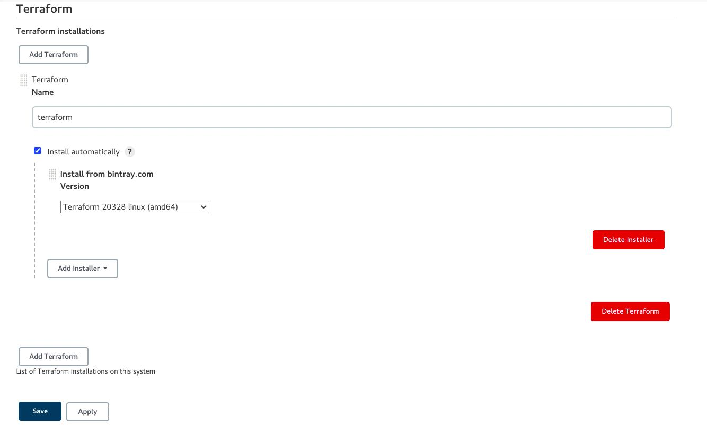
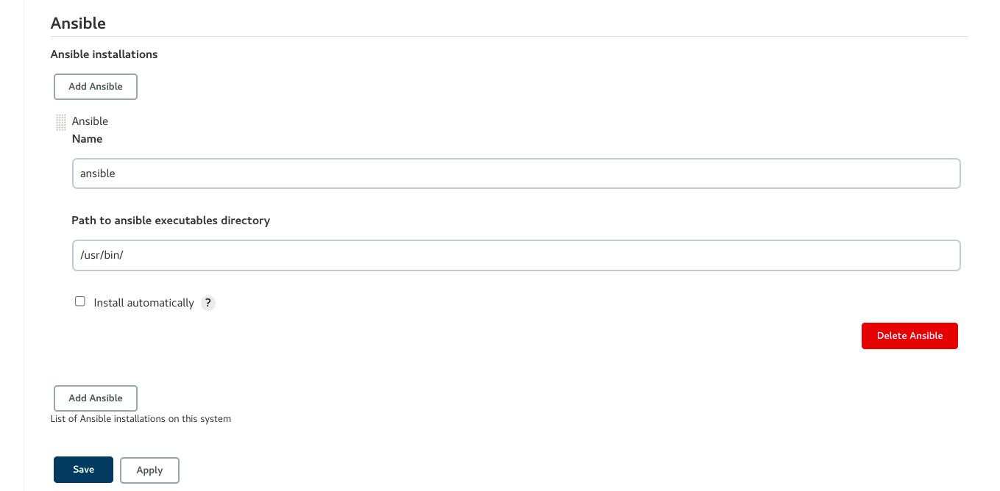
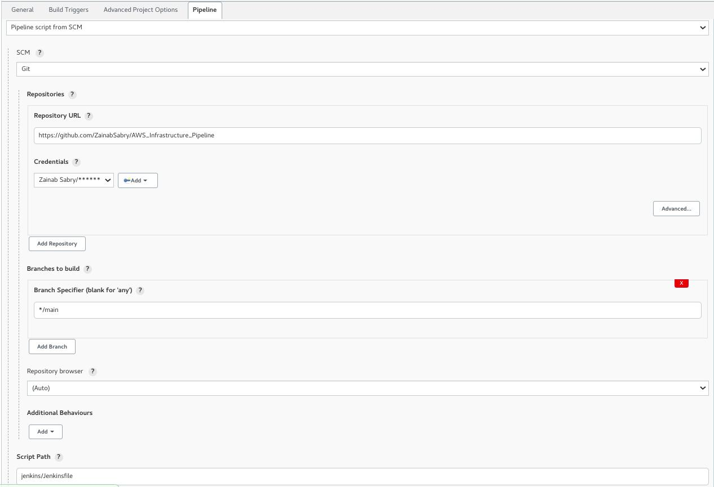
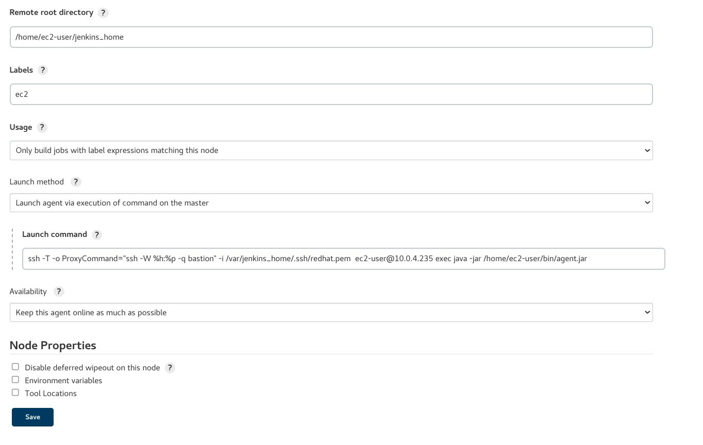

# AWS_Infrastructure_Pipeline

## Architecture Diagram
<br>

<br>
<br>

## Description
<br>
 Using Jenkins pipeline, building VPC with public and private subnets. The public subnet has a bastion host, configured using Ansible to be a proxy server. One of the private subnets has a private instance, configured with Ansible, to be a Jenkins Slave to run on it a Node.js app that connects to an RDS and an ElastiCache Redis instances in another private subnet.
<br><br>
 Jenkins pipeline sends notifications to slack upon success and failure.

<br>

# Getting Started


## 1- Deploying Jenkins Master

To deploy a Jenkins master as a container on your local machine, run the following commands:


```bash
$ docker build -f ./jenkins/jenkins_with_docker -t jenkins_with_docker:latest

$ docker run -d -it -p 8080:8080 -v /var/run/docker.sock:/var/run/docker.sock -v jenkins_data:/var/jenkins_home
jenkins_with_docker:latest
```

Then type in your browser, and follow steps to configure it:
```
http://localhost:8080
```
### Optional Step: Jenkins Slave as a container

To deploy a Jenkins slave as a container on your local machine, run the following commands:

```bash
$ docker build -f ./jenkins/jenkins_slave_with_docker -t jenkins_slave_with_docker:latest

$ docker run -d -it -v /var/run/docker.sock:/var/run/docker.sock jenkins_with_docker:latest
```
Then, go to the Jenkins page and configure it as follows:

- go to "Manage Jankins". Then choose "Manage Nodes and Clouds". From there choose "New Node".

- create a credential of type: SSH Username with private key -> with name: jenkins and your own private key (public key has to be on the container)

- Type a name and configure it as follows:
<p align='center'>

</p>

- Finally, save and press "launch agent"
- Note: always make sure the ssh service is running
```bash
$ docker exec -it -u root CONTAINER_ID bash
$ service ssh start
```

## 2- Running Infrastructure Pipeline

## a- Prequisites:
<br>
For AWS:

- You need to have AWS account and a valid IAM user with programmatic access
- Install two plugins for AWS: "CloudBees AWS Credentials Plugin" for credentials and "Pipeline: AWS Steps" to allow jenkins pipeline steps interact with AWS APIs
- Create a credential of type "aws credentials" where you supply both: 'Access Key ID' and 'Secret Access Key' of your IAM user
<br>

For Terraform:
- Install the "Terraform" plugin and configure under "Manage Jenkins" and "Global Tool Configuration" as follows:

<p align='center'>

</p>

- Note: verify that this installation version is compatible with your OS

- Under terraform, you will find a file for variables, you may set them as you wish:

```
name           = "name"
vpc_cidr       = "172.16.0.0/16"
region         = "eu-central-1"
public_1_cidr  = "172.16.1.0/24"
public_2_cidr  = "172.16.2.0/24"
private_1_cidr = "172.16.3.0/24"
private_2_cidr = "172.16.4.0/24"
instance_type  = "t2.micro"
ami            = "ami-01d9d7f15bbea00b7"
counter        = 1
```
<br>

For Ansible:
- Install "Ansible" plugin, then configure it unser "Global Tool Configuration" as follows:

- Note: you may tick "install automatically" or install ansible on the master yourself:
<p align='center'>

</p>

- Create credential for sshing into the ec2-instance using jump ssh - type (username with private key)

- For Jump SSH server, we need to do the following on master:

    - editing the /var/jenkins_home/.ssh/config file (container)
    ```bash
    $ cd /var/jenkins_home
    $ mkdir .ssh
    $ echo "Host *
        Port 22
        StrictHostKeyChecking no
        UserKnownHostsFile /dev/null
        ServerAliveInterval 60
        ServerAliveCountMax 30

    Host bastion
         HostName 18.209.94.36
        User ec2-user
        IdentityFile ~/.ssh/redhat.pem" > .ssh/config
    ```
    - making sure you have the private key necessary to access the ec2 instances
<br>

For Github:
- Create a credential of type (username with password): password should be a "Personal access token" from github with access to repos

## b- Creating pipeline:
- Create a pipeline as follows:
<p align='center'>

</p>

- Then press 'save' and 'Build Now'

- Upon success, you can proceed with configuring the private ec2-instance as a Jenkins slave

## 3- Private EC2 Instance as Jenkins Slave

- Under "Manage Nodes and Clouds", choose to create a "New Node", give it a name and configure it as follows:

<p align='center'>

</p>
- Command used to connect is:

```bash
$ ssh -T -o ProxyCommand="ssh -W %h:%p -q bastion" -i /var/jenkins_home/.ssh/redhat.pem  ec2-user@PRIVATE_IP_OF_EC2 exec java -jar /home/ec2-user/bin/agent.jar
```
- Press 'save' and 'launch agent'


## 4- Next Steps: Deploying Node.js App on Slave

- You can now proceed with running a CI/CD pipeline to deploy a node.js application on the new slave which also serves to test your application's connectivity to the RDS and ElastiCache instances. <b> Press the icon for the app deployment:</v>
<p align='center'>
<a href="https://github.com/ZainabSabry/CI-CD_Pipeline_nodejs_app.git"></a>
</p>

## Tools
<p align="center">


</p>

