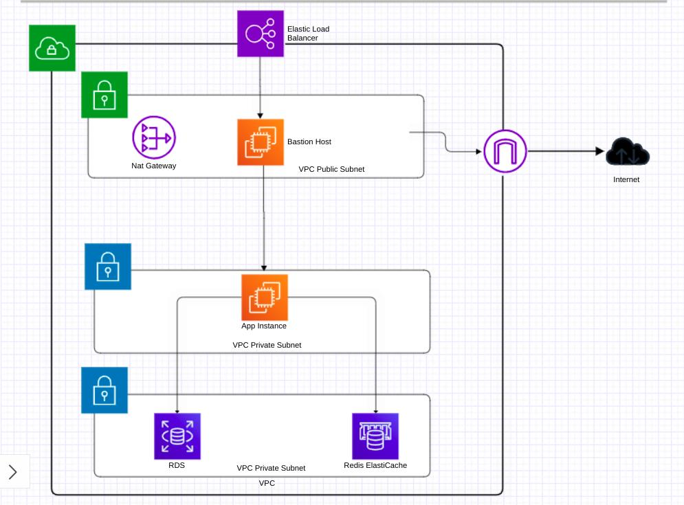

# AWS_Infrastructure_Pipeline

## Architecture Diagram
<br>

<br>
<br>

## Description
<br>
 Using Jenkins pipeline, building VPC with public and private subnets. The public subnet has a bastion host, configured using Ansible to be a proxy server. One of the private subnets has a private instance, configured with Ansible, to be a Jenkins Slave to run on it a Node.js app that connects to an RDS and an ElastiCache Redis instances in another private subnet.
<br><br>
 Jenkins pipeline sends notifications to slack upon success and failure.

<br>

# Getting Started


## 1- Deploying Jenkins Master

To deploy a Jenkins master as a container on your local machine, run the following commands:


```bash
$ docker build -f ./jenkins/jenkins_with_docker -t jenkins_with_docker:latest

$ docker run -d -it -p 8080:8080 -v /var/run/docker.sock:/var/run/docker.sock -v jenkins_data:/var/jenkins_home
jenkins_with_docker:latest
```

Then type in your browser, and follow steps to configure it:
```
http://localhost:8080
```
### Optional Step: Jenkins Slave as a container

To deploy a Jenkins slave as a container on your local machine, run the following commands:

```bash
$ docker build -f ./jenkins/jenkins_slave_with_docker -t jenkins_slave_with_docker:latest

$ docker run -d -it -v /var/run/docker.sock:/var/run/docker.sock jenkins_with_docker:latest
```
Then, go to the Jenkins page and configure it as follows:

- go to "Manage Jankins". Then choose "Manage Nodes and Clouds". From there choose "New Node".

- Type a name and configure it as follows:


